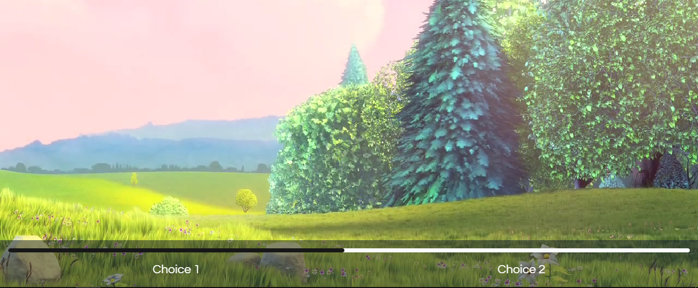
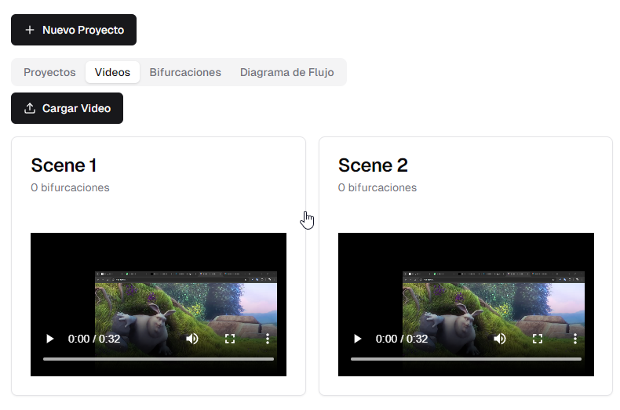

# Interscope

An interactive interface that allows for branching narrative or temporal lines of any audiovisual project, so that the viewer can make real-time decisions regarding the video in question and the direction it takes.

## Features

- Create, edit, and delete projects
- Upload and remove videos from projects
-Create different branches based on user decisions
